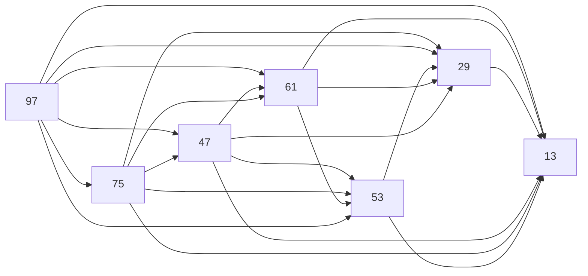

Graph of the dependencies

- DFS from node gives everything after that node

1. Reverse the graph
    - DFS from node _X_ gives everything that must be before the node - _before(X)_
2. Given _X Y_ pair, check that _Y_ is not in _before(X)_
    - this means that either _Y_ is in _after(X)_ or there are no rules for _Y_